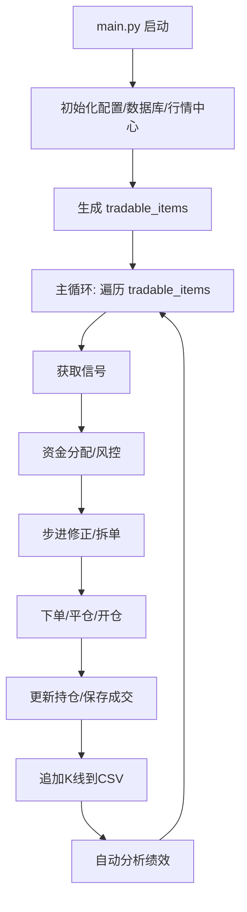

# xWings 量化交易系统

## 项目简介
xWings 是一个支持多账户、多交易所（OKX/Binance）、多币种、多周期的自动化量化交易系统。系统集成了行情采集、信号生成、资金分配、自动下单、持仓管理、成交记录、绩效分析等全流程，支持实盘与回测。

---

## 目录结构
```
xWings/
├── main.py                      # 主入口，自动化交易主循环
├── src/
│   ├── core/
│   │   ├── analytics.py         # 策略绩效分析与回测
│   │   ├── client_manager.py    # 账户、资金、交易所统一管理
│   │   ├── config_manager.py    # 加密配置文件管理
│   │   ├── database.py          # MongoDB数据库操作
│   │   ├── executor.py          # 信号驱动的自动下单与风控
│   │   ├── funds_manager.py     # 资金分配与余额管理
│   │   ├── market_data_center.py# 行情采集与信号生成调度
│   │   ├── signal_generator.py  # 技术指标与信号生成
│   │   ├── trading_state.py     # 持仓状态管理
│   │   ├── exchanges/           # 交易所插件（okx.py, binance.py等）
│   │   └── ...                  # 其他工具与风控模块
│   └── config/                  # 加密配置文件
├── signals/                     # 每个symbol/market_type/timeframe的K线与信号历史CSV
├── requirements.txt             # 依赖包
└── README.markdown              # 项目说明文档
```

---

## 快速启动
1. 配置加密密钥和配置文件（见 src/config/）
2. 安装依赖
   ```bash
   pip install -r requirements.txt
   ```
3. 启动主程序
   ```bash
   python main.py
   ```

---

## 主流程说明（main.py）
- 初始化：加载配置、数据库、账户、行情中心、信号生成器等。
- 主循环：遍历所有 tradable_items（账户/币种/周期/市场类型），
    - 获取信号
    - 资金分配与风控
    - 步进修正、自动拆单
    - 下单与持仓更新
    - 成交与信号写入数据库和CSV
- 自动分析：每轮处理后自动分析最新成交，输出策略绩效指标。
- 资源清理：优雅关闭行情中心、数据库等。

---

## 主交易流程时序图


---

## 核心模块说明

### 1. src/core/analytics.py
- **功能**：策略回测、绩效分析、信号统计、报表生成
- **主要方法**：
    - `track_signal_ohlc(df, signal_col, k_lines)`
      - 追踪信号后N根K线的OHLC数据
      - **参数**：df (DataFrame), signal_col (str), k_lines (int)
      - **返回**：List[Dict]
    - `calculate_price_difference(df, exchange, symbol, market_type, subaccount_id, leverage)`
      - 计算每两笔成交的盈亏、手续费、净利润
      - **参数**：df, exchange, symbol, market_type, subaccount_id, leverage
      - **返回**：List[tuple]
    - `calculate_metrics(df, exchange, symbol, market_type, subaccount_id, initial_capital, risk_free_rate)`
      - 计算胜率、盈亏比、夏普比率等绩效指标
      - **参数**：df, exchange, symbol, market_type, subaccount_id, initial_capital, risk_free_rate
      - **返回**：Dict[str, float]
    - `periodic_analysis(df, exchange, symbol, market_type, subaccount_id, period)`
      - 按周期分组统计绩效
      - **参数**：df, exchange, symbol, market_type, subaccount_id, period
      - **返回**：Dict[pd.Timestamp, Dict[str, float]]

### 2. src/core/signal_generator.py
- **功能**：技术指标计算、信号生成、K线数据管理
- **主要方法**：
    - `get_signal(timeframe)` 获取指定周期的最新信号
    - `update_kline(kline, timeframe)` 更新K线数据
    - `current_klines` 当前所有 symbol/timeframe/market_type 的最新K线字典

### 3. src/core/market_data_center.py
- **功能**：统一采集行情、调度信号生成器
- **主要方法**：
    - `start(symbols, timeframes, market_types, max_data_points)`
    - `start_websocket_ticker(symbols, market_types)`
    - `signal_generators` 所有 symbol/timeframe/market_type 的 SignalGenerator 实例

### 4. src/core/executor.py
- **功能**：信号驱动的自动下单、风控、持仓更新
- **主要方法**：
    - `execute_order(signal_data, quantity)` 根据信号自动下单，自动平仓/开仓、风控、回滚

### 5. src/core/funds_manager.py
- **功能**：资金分配、余额管理、风控
- **主要方法**：
    - `allocate_funds(subaccount_id, symbol, signal, price, market_type, max_allocation, leverage)` 计算可用资金和下单量

### 6. src/core/trading_state.py
- **功能**：持仓状态管理、持仓快照、持仓回滚
- **主要方法**：
    - `update_position(symbol, market_type, position, price, quantity, leverage)` 更新持仓状态
    - `get_position(symbol, market_type)` 获取当前持仓

### 7. src/core/database.py
- **功能**：MongoDB数据库操作，持久化所有关键数据
- **主要方法**：
    - `save_trade(subaccount_id, exchange_name, symbol, market_type, signal, price, quantity, fee, timestamp, order_id, leverage, timeframe)`
    - `find(collection, query, sort, limit)` 查询任意集合

### 8. signals/*.csv
- **功能**：每个 symbol/market_type/timeframe 的K线与信号历史
- **说明**：初始化和每次轮询都会将最新K线追加到对应CSV，便于后续分析和回测

---

## 典型API调用示例

### 获取信号并分析绩效
```python
import pandas as pd
from src.core.analytics import Analytics

analytics = Analytics()
trades = await db.find("trades", sort=[("timestamp", 1)], limit=1000)
df = pd.DataFrame(trades)
metrics = await analytics.calculate_metrics(
    df,
    exchange,  # ExchangeAPI实例
    symbol,    # 交易对
    market_type,  # 市场类型
    subaccount_id # 子账户ID
)
print(metrics)
```

---

## 扩展与二次开发建议
- 新增策略/周期：只需在配置文件中添加，主循环自动适配
- 新交易所接入：实现 ExchangeAPI 子类并注册到 client_manager.py
- 自动报表/可视化：可用 analytics.py 结果生成图表、邮件、网页等
- 多进程/高可用：可用 position_sync_manager.py 定期同步持仓

---

如需更详细的开发文档、API接口说明或集成建议，欢迎联系开发团队！
